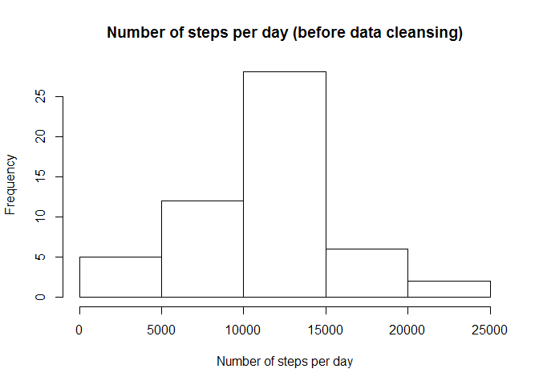
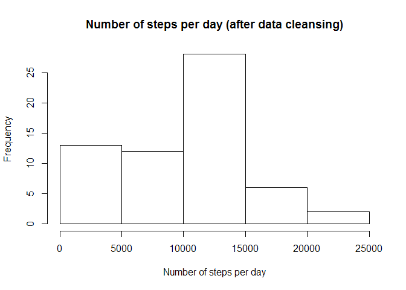
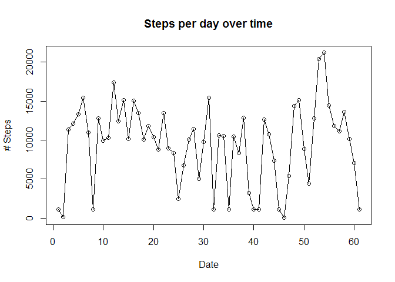
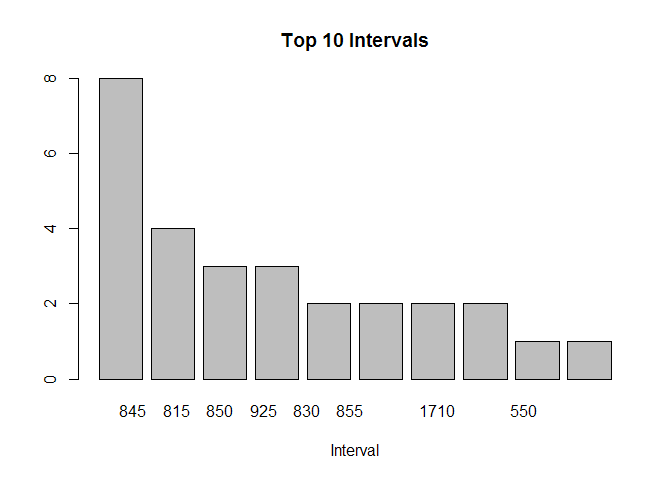
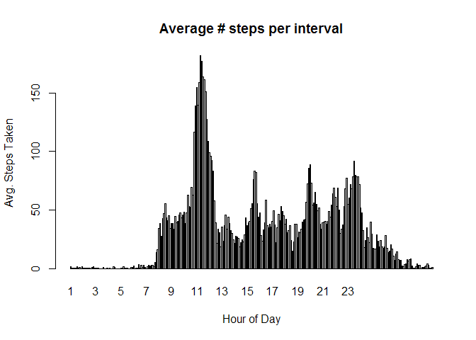
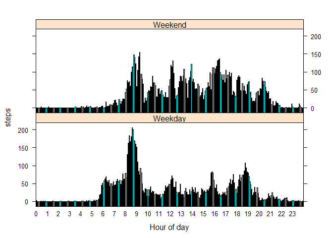

The following report gives an analysis of the fitness data of a single
anonymous individual, collected using a fitness wearable device. It will
offer some basic descriptive statistics relating to the number of steps
walked.

Data cleansing
--------------

Before we commence our analysis, it would be a good idea to check the
quality of our data. In particular, we want to check if there are
missing values in the data.

    # Check each column to see if there are NA values
    df.len <- nrow(df)
    sapply(df, function(x) sum(is.na(x)))  

    ##    steps     date interval 
    ##     2304        0        0

    sapply(df, function(x) sum(is.na(x)) / df.len)  

    ##     steps      date  interval 
    ## 0.1311475 0.0000000 0.0000000

We can see above that there are NA values in the steps column (2304
values, or 13.11% of all values). Presumably, these values are due to
either:

1.  An error in the device which caused the data to be lost, or:
2.  No data being logged for a certain interval due to inactivity.

It would make sense to try determine whether these NAs might just
represent valid periods of inactivity, in which case we may want to
treat them as valid zero values.

In order to check this assumption, we could check the data to see if
there are zero values in the data. Presence of explicit zero values
would tend to suggest that the NA values are not a valid representation
of no activity.

    # Check how many observations there are with zero values for steps
    df.len <- nrow(df)
    df.cc <- complete.cases(df) # we want to omit NA cases specifically
    z <- length(df$steps[df$steps==0 & df.cc]) # zeros that aren't NAs

    # Show the results
    z # total number of zero cases

    ## [1] 11014

    z / df.len # percentage of zero cases

    ## [1] 0.6269353

From the above, we can see that there are plenty of valid zero values in
the data, so it's quite likely that the NA values may be due to some or
other error in the device. On this basis, it would make sense to rather
impute them in order to avoid skewing the data.

The simplest strategy for this approach would be to simply take the
median value for each interval across the entire dataset, and impute
that value to the NA observations, since we know which interval they are
for.

    # Obtain the median number of steps per interval
    df.nona <- df[is.na(df$steps) == FALSE,]  # remove the NAs first...

    mspi <-
        aggregate(
            list(median.steps = df.nona$steps)
        ,   by=list(interval = df.nona$interval)
        ,   FUN=median
        )

    # Next, we need to impute the missing values to a cleaned dataset
    df.cleaned <- df 

    impute.NA <- function (x, y) {
        if(is.na(x) == FALSE) {
            return(x)
        }
        
        return(y)
    }

    df.cleaned$steps <- 
        apply(
            inner_join(
                df
            ,   mspi
            ,   by="interval"
            )
        ,   1
        ,   function(row) as.integer(impute.NA(x = row["steps"], y = row["median.steps"]))
        )

Now we can compare the histograms for number of steps per day before and
after the data-cleansing procedure...

<!-- --><!-- -->

Analysis
--------

We can see from our data that our subject walked a mean 9503 steps and a
median 10395 steps per day.

Let's see what the number of steps taken looks like over time...

<!-- -->

We can see that there is a fair amount of variability in the steps
walked per day, with no immediately discernable pattern, and a couple of
obvious days on which there was a very low amount of activity (often
followed by a day of above average activity).

Next we want to see which particular 5-minute interval, on average,
contains the maximum number of steps for the day.

    # Firstly get the maximum value in any one interval per day
    max.steps.pd <- 
        aggregate(
            list(max.steps = df.cleaned$steps)
        ,   by=list(date = df.cleaned$date)
        ,   FUN=max
        )

    # Next, find those numbered intervals which matched the maximum steps
    joined.cases <- inner_join(max.steps.pd, df.cleaned, by="date")
    matched.cases <- joined.cases %>% filter(steps==max.steps)

    # Then we find which of the numbered intervals yields the greatest number of matches
    matched.cases$count = 1
    summed.cases <- 
        aggregate(
            list(number.of.max.occurrences = matched.cases$count)
        ,   by=list(interval = matched.cases$interval)
        ,   FUN=sum)

    no.vals.to.display <- 10

    top.n.intervals <- 
        head(
            arrange(
                summed.cases
            ,   desc(number.of.max.occurrences)
            )
        , no.vals.to.display)

    top.n.intervals$ordinal.pos <- c(1:no.vals.to.display)

    barplot(
        height=top.n.intervals$number.of.max.occurrences
    ,   xaxt="n", xlab="Interval"
    ,   main=paste(c("Top", no.vals.to.display, "Intervals"), collapse = " "))
      
    axis(
        1
    ,   at=1:no.vals.to.display
    ,   labels=top.n.intervals$interval
    ,   tick=FALSE
    )

<!-- -->

From the above, we can see that the five-minute interval between 8:15AM
and 8:20AM is most frequently the time interval with the maximum number
of steps. However, the number of times this occurs is pretty low (4 days
out of the two months we are analysing), so we probably want to rather
take a look at the average number of steps taken per interval per day,
as this is a better indicator of which times generally generated more
activity

    # Draw a plot of the average number of steps per day, per interval
    spi <- 
        setNames(
            aggregate(
                df.cleaned$steps
            ,   by=list(df.cleaned$interval)
            ,   FUN=mean)
        ,   c("interval", "steps")
        )

    spi <- arrange(spi, interval) # ensure that the intervals are in order

    barplot(
        height=spi$steps
    ,   xaxt="n", xlab="Hour of Day", ylab="Avg. Steps Taken"
    ,   main="Average # steps per interval"
    )

    axis(
        1
        ,   at=seq(1, 288, 12)
        ,   labels=seq(1, 24, 1)
        ,   tick=FALSE
    )

<!-- -->

We can see from this graph that activity generally starts at around
8:00AM, peaks at 11:00AM, and then experiences periodic spikes at around
3:30PM, 8:0PM and after 11:00PM. Let's see what pattern emerges when we
split it by weekdays vs. weekends.

    # Work out which days are weekends and which are weekdays
    df.cleaned$day.of.week <- weekdays(as.Date(df.cleaned$date))
    df.cleaned$weekday.weekend[
        df.cleaned$day.of.week == "Saturday" 
    |   df.cleaned$day.of.week == "Sunday"
    ] <- "Weekend"
    df.cleaned$weekday.weekend[is.na(df.cleaned$weekday.weekend)] <- "Weekday"

    # Aggregate the average number of steps taken per interval, per weekday/weekend
    # split
    spi <- 
        setNames(
            aggregate(
                df.cleaned$steps
            ,   by=list(
                    df.cleaned$interval
                ,   df.cleaned$weekday.weekend
                )
            ,   FUN=mean)
        ,   c("interval", "weekday.weekend", "steps")
        )

    # Draw a plot of the average number of steps per day, per interval, per 
    # weekday/weekend split
    barchart(
        steps ~ interval | factor(weekday.weekend)
    ,   data=spi
    ,   horizontal=FALSE, layout=c(1,2)
    ,   scales=list(
            x=list(
                at=seq(1,288,12)
            ,   labels=seq(0,23,1)
            )
        )
    , xlab="Hour of day"
    )

<!-- -->

Here we can see some clear differences in behaviour between weekends and
weekdays:

-   Weekend activity is more spread out throughout the day, whereas
    weekday activity is clustered around commuting times and lunchtime.
-   Weekend activity continues until much later in the evening than
    weekday activity.
-   On the whole, the subject is more active on weekends than during the
    weekday.
